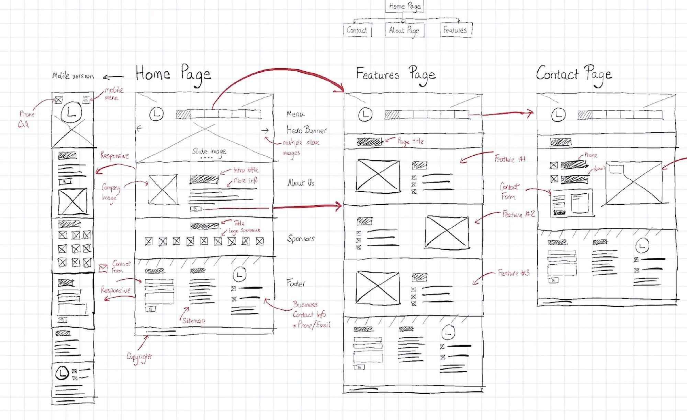

# Einführung:  
## Entwurf einer Webseite mittels Wireframe

*(Kurzinput, ca. 10 Minuten)*

---

# 1. Einstieg

💡 Frage: *Wie entsteht eigentlich eine Webseite?*  
- Starten wir gleich mit HTML/CSS?  
- Oder gibt es Zwischenschritte?

➡️ Wireframes = die **Baupläne** für Webseiten.

---

# 2. Was ist ein Wireframe?

- **Abstrakte Skizze** einer Webseite  
- Fokus: **Struktur & Funktionen**  
- Noch keine Farben, Bilder, Schriften  

🖼️ Analogie: Grundriss beim Hausbau

---

# 3. Warum Wireframes?

✅ Schnell Ideen ausprobieren  
✅ Gemeinsames Verständnis im Team  
✅ Feedback, bevor Aufwand ins Design/Code geht  
✅ Fehler früh erkennen → spart Zeit & Kosten  

---

# 4. Methoden & Tools

**Low-Fidelity (Lo-Fi):**  
✏️ Stift & Papier, Whiteboard  

**High-Fidelity (Hi-Fi):**  
🖥️ Digitale Tools (z. B. Balsamiq, Figma, Adobe XD, Miro)  

👉 Für den Einstieg reicht Papier völlig!

---

# 5. Mini-Beispiel

➡️ Einfach & schnell, keine Kunstwerke nötig!

---

# 6. Fazit

Wireframes = **Denken in Strukturen**  

👉 Erst die Struktur  
👉 Dann das Design  
👉 Dann der Code
